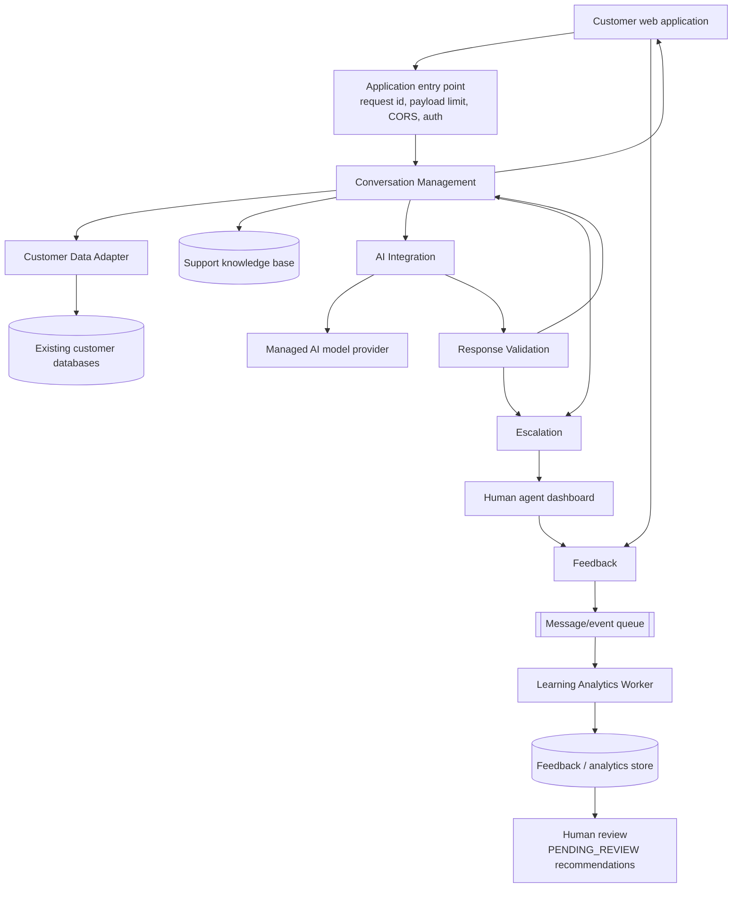
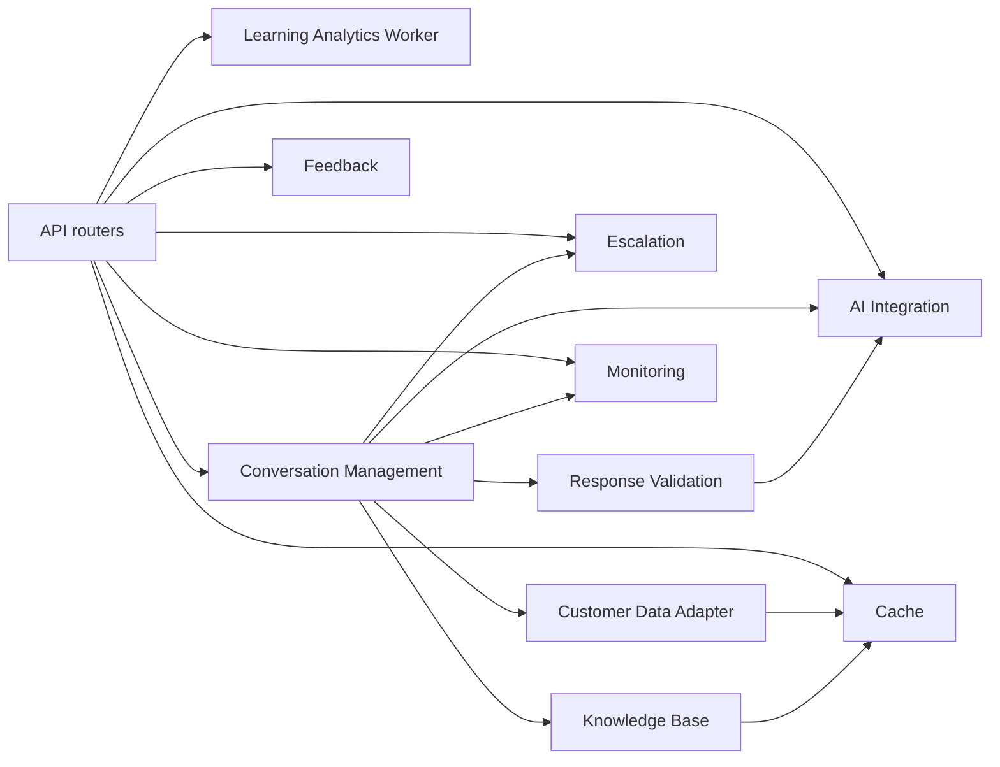

# Architecture — as built in the Alpha

SkillBridge AI. Component names follow the System Design Specification.

Modular monolith with asynchronous worker processing. One deployment unit, with
module boundaries enforced by import direction and interface ownership.

## Boundaries

| Boundary | Contents | Enforced by |
| --- | --- | --- |
| Client layer | Customer web app, agent dashboard | Reach the API only over HTTP, via `src/api/client.js` |
| Infrastructure | Request identity, payload limits, CORS, auth, error contract | `app/main.py`, `app/errors.py`, `app/security.py` |
| Core modular monolith | Conversation, Customer Data Adapter, AI Integration, Response Validation, Escalation, Feedback, Knowledge Base | `app/modules/*`, each with its own service class |
| Asynchronous processing | Event outbox, Learning Analytics Worker | `feedback_events` table, `app/modules/analytics/worker.py` |
| Data layer | PostgreSQL application tables, knowledge base, feedback/analytics store | `app/models.py` |
| External systems | Existing customer databases, managed AI provider | `LegacyCustomerMaster` (simulated), `providers/*` |

## Primary flow

Individual conversations never retrain or reconfigure the production AI.
Patterns are aggregated, written as `PENDING_REVIEW`, and applied only after a
person approves them.

## Module dependency graph

Generated from the actual `import` statements in `backend/app` by
`scripts/generate_module_graph.py`, so it cannot drift from the code. CI fails
if it is out of date; regenerate with `python scripts/generate_module_graph.py --write`.

Read it as "depends on". The shape to look for: Conversation Management fans
out to the components it orchestrates, nothing fans back into it, and Cache and
Monitoring are leaves.

<!-- BEGIN GENERATED MODULE GRAPH -->

<!-- END GENERATED MODULE GRAPH -->

The boundaries this graph must obey are enforced by
`backend/tests/test_architecture_boundaries.py`. Changing one of those rules is
an architecture decision and belongs in `docs/adr/`.

## One customer turn, step by step

`ConversationService.process_message` is the only orchestrator:

1. **Validate input** — blank or over 2,000 characters → 422 `INVALID_MESSAGE`.
2. **Authorize** — the conversation must belong to the authenticated user
   (403 otherwise); a closed conversation returns 409.
3. **Persist the customer turn.**
4. **Pre-AI escalation rules** — a request for a person or security-sensitive
   content escalates immediately; the model is never called.
5. **Minimise context** — the message is classified (`CREDENTIAL`,
   `EDUCATION`, `TRANSITION`, `CAREER`, `GENERAL`) and the adapter exposes only
   the fields that inquiry type permits. A question about timing, for example,
   does not carry the member's training record. Knowledge retrieval returns at
   most two approved articles.
6. **Generate** — the AI Integration Module builds a provider-neutral prompt
   and applies the retry policy.
7. **Validate the response** — empty, over-long, leaking identifiers or
   internal instructions, or claiming an account action → rejected.
8. **Decide** — provider failure, unsupported topic or validation failure each
   map to their escalation reason; otherwise the answer is returned.
9. **Persist and log** — the turn is stored with its knowledge sources, and
   elapsed time is logged against the five-second target.

## Why the boundaries sit where they do

**Customer Data Adapter.** `LegacyMemberMaster` uses abbreviated column names
(`mbr_nbr`, `svc_brnch_cd`, `cmpltd_trng_txt`) and semicolon delimited lists on
purpose -- that is what a record from an older system of record looks like.
Only the adapter reads it; everything else consumes `CustomerContext`. A schema
change over there is absorbed in one file.

**AI Integration.** No module outside it imports a provider SDK or constructs a
prompt. `build_provider()` selects the implementation from configuration, so
the provider can be replaced, and the module could later be extracted into its
own service, without touching callers.

**Response Validation.** Separate from generation so the rules that decide what
a customer may see are testable without a model, and so a provider change
cannot weaken them.

**Escalation.** Owns the rules, case creation, queue placement and handover
summary. It does not read the legacy database and does not build prompts.

**Feedback and analytics.** The Feedback Module writes an outbox row and
returns; nothing about analysis is on the customer's request path.

## Local runs and the data layer

PostgreSQL is the data layer: the design specifies it, CI tests every commit
against a PostgreSQL service, and a deployment uses it. `run.py` connects to
PostgreSQL whenever a server is reachable.

When none is reachable it falls back to a local SQLite file so the platform
still starts on a machine that has nothing installed. This is a connection-URL
substitution, not a second implementation — the models, the session handling
and every module are identical, which the portable `GUID` column type in
`app/db.py` is what makes possible. The live engine is reported at
`/api/v1/health` under `dependencies.database_engine` so a demonstration can
never be ambiguous about which one is in use.

For the same reason the application can create its schema and load synthetic
seed data on startup (`AUTO_BOOTSTRAP`, on for development). CI and the
integration job set it to `false` and run `python -m app.bootstrap` as an
explicit, visible pipeline step.

## Components implemented in barebones form

Three components in the architecture diagram exist with a real interface and
real call sites, but with deliberately shallow implementations. Each is honest
about what it is not.

**Cache (Data Layer).** `CacheService` with an `InMemoryCache` implementation.
The Knowledge Base reads through it (approved content is identical for every
customer, so it is the safest thing to cache) and the Customer Data Adapter
reads through it keyed by customer *and inquiry type* -- a shared key would
serve a context permitted for one inquiry type to another, widening what
reaches the AI provider. Not built: shared storage, eviction under memory
pressure, warming, invalidation on customer-data writes. Because the cache is
process-local it does not satisfy the stateless-instance requirement, which is
precisely why callers depend on the interface rather than a dictionary of their
own: a Redis implementation is one class and a configuration change.

**Monitoring and Logging (Infrastructure).** Request counts by status class,
conversation turns by status, escalations by reason, and turn-latency
percentiles against the five-second target. The entry-point middleware records
requests and the Conversation Management Module reports each turn, so the
component observes the modules by being called rather than reaching into them.
Not built: export to a metrics backend, alerting, distributed tracing, log
shipping. Counters are per-process, so `instanceId` is reported alongside them
rather than implying a cluster-wide total.

**Reviewed AI Configuration / Routing Improvements (Asynchronous Processing).**
The worker writes candidates as `PENDING_REVIEW`, agents approve or reject them
through the dashboard, and a decision is final. Not built: applying an approved
recommendation. Nothing reads an `APPROVED` row and changes a prompt or routing
rule. The constraint that matters is already enforced -- an individual
conversation can only contribute to an aggregate that a person must act on.

The load-balanced entry point is represented by the middleware chain and by
`instanceId`; running multiple instances behind an actual load balancer is a
deployment exercise, not an application change.

## Scaling notes

Application instances are stateless: identity comes from a signed token, and
all shared state is in PostgreSQL. The two Alpha exceptions are documented
rather than hidden — in-memory rate-limit counters move to the shared cache,
and the outbox table becomes a managed queue. The 10,000 concurrent-user target
is a load-testing task, not an architectural claim.
