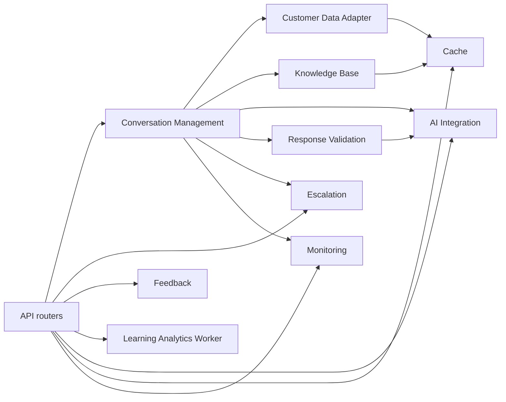
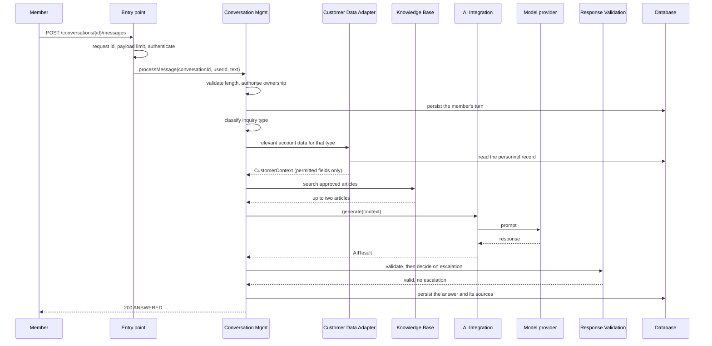
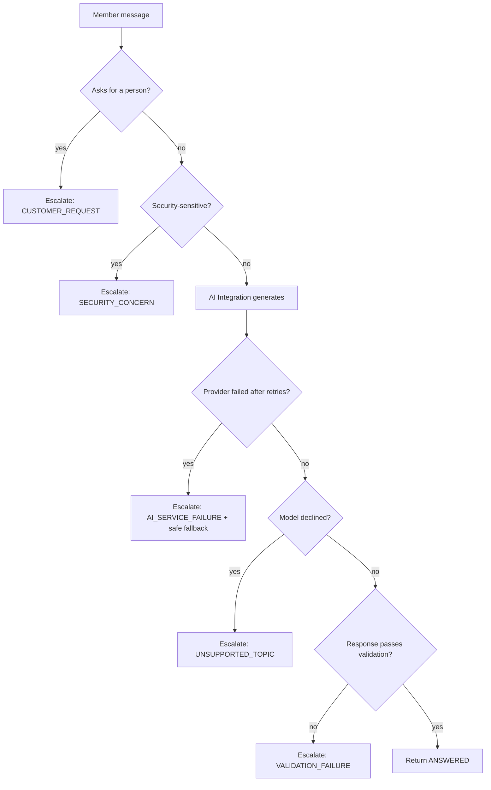
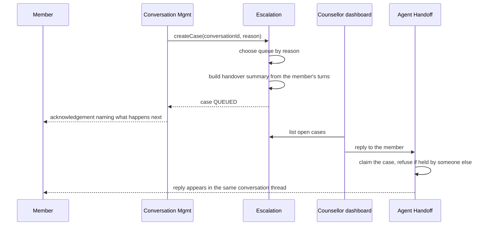
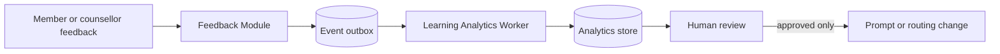

# SkillBridge AI — Architecture Design Document

**Owner:** Ravonne Wade, Lead Architect
**Status:** Alpha release (Unit 5)
**Companion documents:** `ARCHITECTURE.md` (as-built notes and the generated
module graph), `API.md` (interface contracts), `adr/` (decision records)

---

## 1. Purpose and scope

This document defines the architecture of SkillBridge AI: the components, the
boundaries between them, the relationships among them, and the paths data takes
through the system.

SkillBridge AI is a free education and professional development service for
military members and veterans. A member asks a question about certifications,
degrees, apprenticeships or civilian careers, and the platform answers using
approved reference material and the training that member has already completed.
When it cannot answer well, it hands the conversation to a human career
counsellor rather than guessing.

In scope: the application architecture, its internal boundaries, its data
flows, and how those boundaries are enforced. Out of scope: infrastructure
provisioning, the user interface design, and the model provider's own internals.

### 1.1 Architectural drivers

Four requirements shaped every significant decision.

| Driver | Consequence for the architecture |
| --- | --- |
| Support up to 10,000 concurrent users | Application instances hold no session state, so they scale horizontally |
| Integrate with an existing personnel system | One adapter owns the legacy schema; nothing else sees it |
| Isolate the AI feature from core functions | The model sits behind an interface; no other component knows a provider exists |
| Remain maintainable by junior developers | One deployable, one database, one place to follow a request end to end |

The fourth driver is the one that decided the style. The first three are often
read as an argument for microservices; the fourth outweighs them for a
three-person team on an eight-week schedule. ADR 0001 records that reasoning in
full.

---

## 2. Architectural style

**A modular monolith with asynchronous worker processing.**

The core application is one deployable with strongly separated internal
modules. Feedback analysis runs through a queue and a separate worker, so it
never sits on a member's request path — a Web-Queue-Worker arrangement attached
to the side of the monolith rather than a second service in front of it.

Separation of *concerns* is a requirement. Separation of *processes* is not,
and buying it would cost service discovery, cross-service data consistency,
interservice communication and independent deployment — none of which produce a
member-visible feature.

---

## 3. Layered view

Six layers, each with a rule about what it may depend on.

| Layer | Contents | May depend on |
| --- | --- | --- |
| Client | Member web application, counsellor dashboard | The public API only, over HTTPS |
| Infrastructure and entry | Load balancer, request identity, payload limits, CORS, authentication and authorisation, monitoring | Core modules |
| Core modular monolith | Conversation Management, Customer Data Adapter, Knowledge Base, AI Integration, Response Validation, Escalation, Feedback | Each other, only as section 5 permits |
| Asynchronous processing | Event queue, Learning Analytics Worker | The data layer |
| Data | Application database, knowledge store, feedback and analytics store, cache | Nothing |
| External systems | Existing personnel database, managed AI model provider | Nothing |

The client layer never reaches past the API. The core layer never reaches back
into the API — business logic has to remain callable by the worker and by any
future background job without dragging the web framework along.

---

## 4. Component catalogue

Each component has one responsibility, one entry point, and an explicit list of
things it must not do. The "must not" column is the part that keeps the
boundary real; without it, a component slowly absorbs its neighbours.

| Component | Responsibility | Entry point | Must not |
| --- | --- | --- | --- |
| **Conversation Management** | Orchestrate one member turn from validation to persistence | `ConversationService` | Talk to a provider, read the personnel schema, construct prompts |
| **Customer Data Adapter** | Translate the legacy personnel record into `CustomerContext`, and decide which fields an inquiry may see | `CustomerDataAdapter` | Leak legacy column names or codes to any caller |
| **Knowledge Base** | Retrieve approved reference articles | `KnowledgeBaseService` | Expose storage details; rank by anything the caller cannot inspect |
| **AI Integration** | Build a provider-neutral prompt, call the provider, apply the retry policy, produce a safe fallback | `AIIntegrationService` | Touch the database; decide whether an answer reaches a member |
| **Response Validation** | Decide whether a generated response may be shown, and what escalation a failure implies | `ResponseValidationService` | Generate text; call a provider |
| **Escalation** | Own escalation rules, case creation, queue placement, handover context, and the counsellor reply path | `EscalationService`, `AgentHandoffService` | Query the personnel database; build prompts |
| **Feedback** | Record member and counsellor feedback and publish an event | `FeedbackService` | Change AI behaviour directly |
| **Learning Analytics Worker** | Aggregate interaction patterns into improvement candidates for human review | `LearningAnalyticsWorker` | Apply a change to the running system |
| **Cache** | Short-lived storage for data that is expensive to fetch and safe to reuse | `CacheService` | Depend on any other component |
| **Monitoring** | Count requests, turns, escalation reasons and latency | `Metrics` | Depend on any other component |

### 4.1 Why Conversation Management is the only orchestrator

Exactly one component knows the order of a member turn. If a second component
also sequenced those steps, the two would eventually disagree — most likely
about when escalation happens relative to validation — and a member would get
different behaviour depending on which path handled the request. Everything
else is a service that answers a question and returns.

### 4.2 Why the adapter matters more than it looks

The legacy personnel record stores abbreviated codes and semicolon-delimited
lists. If any other component read it directly, three things would follow: a
schema change over there becomes a change in several places here; the
field-minimisation rules can be bypassed by going around the adapter; and the
legacy vocabulary spreads through code that has no business knowing it.

The adapter is also where data minimisation is implemented, which makes it a
privacy control and not only a translation layer. See section 6.2.

---

## 5. Component boundaries

### 5.1 Permitted dependencies

Read every arrow as "depends on". Three shapes are load-bearing:

- **Conversation Management fans out, and nothing fans into it.** One
  orchestrator.
- **Escalation depends on no other component.** It reaches the data layer and
  the shared contracts, nothing else. That is what keeps escalation rules
  deterministic and testable without a model or a personnel record.
- **Cache and Monitoring are leaves.** Anything may use them; they use nothing.
  A dependency in the other direction would risk a cycle and make them
  impossible to call from arbitrary places.

### 5.2 How the boundaries are enforced

Prose cannot stop anyone adding an import. `backend/tests/test_architecture_boundaries.py`
parses the source and fails the build when a rule is broken:

| Rule | Protects |
| --- | --- |
| No module imports the API layer | Core logic stays framework-independent |
| Only the adapter reads the legacy personnel table | Section 4.2 |
| No provider imported outside AI Integration | Provider substitution stays configuration |
| AI Integration never imports the data layer | Keeps it the first candidate for extraction |
| Escalation depends on no other component | Section 5.1 |
| Only the API layer imports Conversation Management | Section 4.1 |
| Cache and Monitoring depend on nothing | Section 5.1 |
| No dependency cycles | A cycle means a boundary is fiction |
| Shared contracts import no component | Vocabulary stays vocabulary |
| Components on disk match this document | A new folder is a new box on this diagram |

`scripts/generate_module_graph.py` derives the diagram above from the real
imports, and `--check` fails if this document has drifted from the code.

Changing one of these rules is an architecture decision and belongs in `adr/`,
not in a quiet edit.

---

## 6. Primary data flow paths

### 6.1 An answered turn

The member's turn is persisted *before* the assistant is involved, so the
question survives a failure anywhere downstream.

### 6.2 Data minimisation on that path

The member's record holds more than any one question needs. The adapter decides
per inquiry type what may be shared, and only those fields are rendered into a
prompt.

| Inquiry type | Fields the adapter may expose |
| --- | --- |
| `CREDENTIAL` | Occupational specialty, completed training, credentials held |
| `EDUCATION` | Branch, years of service, completed training |
| `CAREER` | Occupational specialty, years of service, completed training, credentials |
| `TRANSITION` | Branch, years of service, separation date |
| `GENERAL` | Branch |

A question about internship timing therefore never carries the member's
training record off the platform. Classification is a fixed keyword rule rather
than a model call, precisely because it governs what leaves the system and so
must be predictable and reviewable.

The cache is keyed by member **and** inquiry type for the same reason. A single
key would let a context assembled for one inquiry type be served to another,
silently widening what reaches the provider.

### 6.3 An escalated turn

Escalation is rule-based, not confidence-based. A language model exposes no
calibrated probability that its answer is correct, so any threshold would be
untestable and would change meaning whenever the model version moved (ADR 0004).

The first two rules run **before** the provider is called. A security-sensitive
message never leaves the platform, which makes this a privacy control as well
as a routing one.

Validation rejects a response that is empty, over-long, contains sensitive
identifiers, leaks internal instructions, claims an action only a counsellor
can take, or guarantees an outcome nobody can guarantee.

### 6.4 Human handover

Two decisions worth stating. The counsellor's reply is written into the
member's own conversation rather than a separate ticket, so the member sees one
continuous thread. And replying claims the case, because answering a member is
taking responsibility for them — assignment should not wait for a button.

Security-sensitive escalations route to a different queue from career
questions, because the people who staff them are different.

### 6.5 Feedback and learning

An individual conversation never changes production AI behaviour. Feedback
contributes to an aggregate; the worker turns recurring patterns into
candidates marked `PENDING_REVIEW`; a person approves or rejects each one. Even
an approved candidate is applied by hand in the Alpha — nothing reads an
approval and reconfigures the running system.

The event is written in the same transaction as the feedback itself. That is a
genuine advantage over publishing to a broker, where a crash between the commit
and the publish loses the event (ADR 0003).

---

## 7. Data ownership

| Store | Owner | Read by |
| --- | --- | --- |
| Users | Authentication | Authentication only |
| Conversations, messages | Conversation Management | Conversation Management, Escalation |
| Escalation cases | Escalation | Escalation |
| Feedback records, event outbox | Feedback | Feedback, Learning Analytics Worker |
| Improvement recommendations | Learning Analytics Worker | Worker, counsellor dashboard |
| Knowledge articles | Knowledge Base | Knowledge Base |
| Legacy personnel record | Customer Data Adapter | Customer Data Adapter |

One component writes each store. Where a second component reads one — Escalation
reading conversation messages to build a handover summary — it reads and does
not write.

---

## 8. Cross-cutting concerns

| Concern | Where it lives | Note |
| --- | --- | --- |
| Identity | Signed token, verified per request | The user is re-loaded from the database each request, so a revoked or role-changed account cannot ride an unexpired token |
| Authorisation | Route dependencies | Members reach only their own conversations; counsellor routes require the agent role |
| Error contract | One handler set | Every failure is `{code, message, requestId}`; internal detail is logged, never returned |
| Request correlation | Entry-point middleware | A request id on every response and in every error body |
| Observability | Monitoring component | Counters are per-instance, and the instance id is reported so that is never mistaken for a cluster total |
| Caching | Cache component | Keyed to prevent cross-inquiry reuse (section 6.2) |
| Rate limiting | Per authenticated user | In-process in the Alpha; see section 10 |

---

## 9. Quality attributes

| Attribute | How the architecture addresses it | Verified? |
| --- | --- | --- |
| Scalability | Stateless instances; shared state in the database; background analysis off the request path | Architecturally yes; **not load tested** |
| Performance | Bounded prompt size, cached reference data, latency measured against a five-second target | Measured locally; not under load |
| Reliability | Provider failure produces a safe fallback and a human handover rather than an error | Yes, tested |
| Security | Identity from the verified token only; least-privilege data sharing; security-sensitive content never reaches the provider | Yes, tested |
| Maintainability | One responsibility per component, documented interfaces, boundaries enforced in CI | Yes, enforced |
| Testability | Components callable without a web framework; a mock provider exercises the full path with no key or cost | Yes |

**The 10,000-user figure is a requirement, not an achievement.** The
architecture permits horizontal scaling. Demonstrating that capacity requires
load testing that has not been done, and this document should not be read as
claiming otherwise.

---

## 10. Known architectural debt

Each of these is a deliberate Alpha decision with a known cost.

| Item | Consequence | Resolution |
| --- | --- | --- |
| Cache and rate-limit counters are in process | Instances are not truly stateless for these two concerns | Move both to the shared cache |
| Event queue is a database outbox | No fan-out, no delivery guarantees, no back-pressure | Managed broker behind the same `FeedbackService` method |
| Worker runs on demand | No scheduled aggregation | Trigger from the queue |
| Monitoring counters are per instance and not exported | No cluster view, no alerting, no tracing | Export to a monitoring backend |
| Approved recommendations are not applied | The learning loop stops at human review | Deliberate for now; automating it needs its own decision |
| Retry budget can exceed the latency target | A worst-case turn can take far longer than five seconds | Reduce the timeout and bound the total budget |
| Synchronous provider call holds a worker thread | Thread pool exhaustion under load | Convert the provider and service to async |
| No handling for a member in distress | A service for veterans needs one before real use | Out of Alpha scope; must be designed before any real deployment |

---

## 11. Deployment view

**Target.** Multiple stateless application instances behind a managed load
balancer; PostgreSQL as the application database; a managed cache; a managed
queue; the model provider reached over HTTPS. Scaling is adding instances.

**Alpha.** One instance, PostgreSQL where available and a local SQLite file
where not, in-process cache, database outbox, worker run on demand. Every
difference is listed in section 10. `/api/v1/health` reports which database
engine and which model provider are live, so a demonstration is never ambiguous
about what it is showing.

CI runs the full test suite against a real PostgreSQL service on every push,
so the supported data layer is exercised continuously even when local runs use
the fallback.

---

## 12. Traceability

| System Design Specification element | Where it is implemented |
| --- | --- |
| Conversation Management Module | `app/modules/conversation/` |
| Customer Data Adapter | `app/modules/customer_data/` |
| AI Integration Module | `app/modules/ai_integration/` |
| Response Validation Module | `app/modules/validation/` |
| Escalation Module | `app/modules/escalation/` |
| Feedback Module | `app/modules/feedback/` |
| Support Knowledge Base | `app/modules/knowledge/` |
| Message/Event Queue | `feedback_events` table |
| Learning Analytics Worker | `app/modules/analytics/` |
| Cache | `app/modules/cache/` |
| Monitoring and Logging | `app/modules/monitoring/` |
| Authentication and Authorization | `app/security.py` |
| Load Balancer / Entry Point | `app/main.py` middleware; instance id in health |
| Existing personnel database | `LegacyMemberMaster` (synthetic) |
| Managed AI Model Provider | `app/modules/ai_integration/providers/` |

Every component named in the specification exists in code. Section 10 states
honestly which of them are implemented in barebones form.

---

## 13. References

Amazon Web Services. (2024, November 6). *Reliability pillar — AWS
Well-Architected Framework*.

Amazon Web Services. (n.d.). *Inference using Converse API*. Amazon Bedrock
User Guide.

Microsoft. (2025, October 14). *Architecture styles*. Microsoft Learn.
