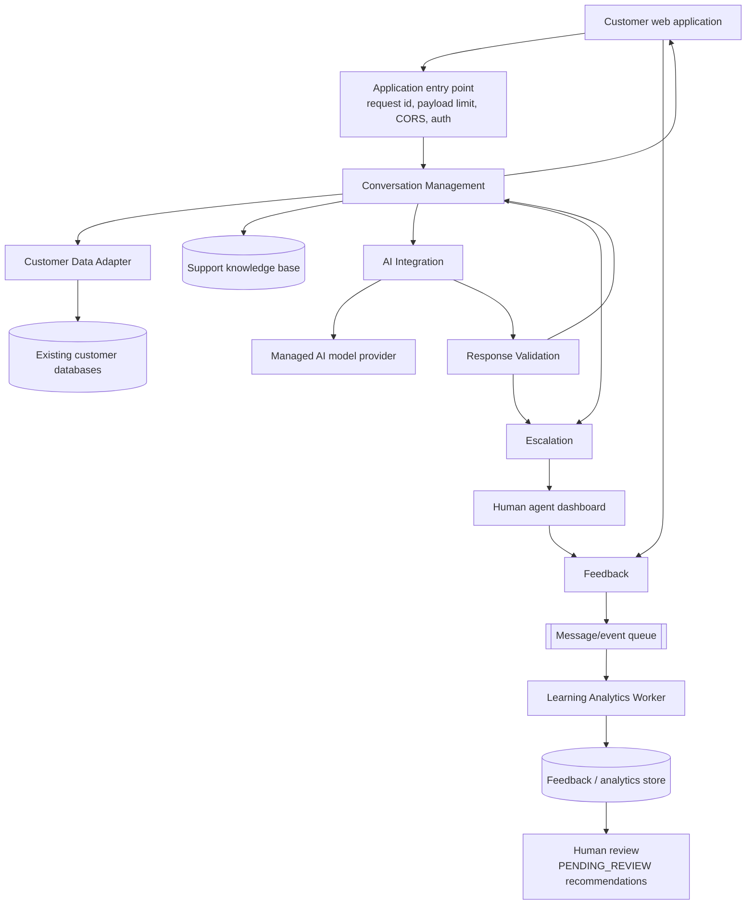

# Architecture — as built in the Alpha

Modular monolith with asynchronous worker processing. One deployment unit, with
module boundaries enforced by import direction and interface ownership.

## Boundaries

| Boundary | Contents | Enforced by |
| --- | --- | --- |
| Client layer | Customer web app, agent dashboard | Reach the API only over HTTP, via `src/api/client.js` |
| Infrastructure | Request identity, payload limits, CORS, auth, error contract | `app/main.py`, `app/errors.py`, `app/security.py` |
| Core modular monolith | Conversation, Customer Data Adapter, AI Integration, Response Validation, Escalation, Feedback, Knowledge Base | `app/modules/*`, each with its own service class |
| Asynchronous processing | Event outbox, Learning Analytics Worker | `feedback_events` table, `app/modules/analytics/worker.py` |
| Data layer | PostgreSQL application tables, knowledge base, feedback/analytics store | `app/models.py` |
| External systems | Existing customer databases, managed AI provider | `LegacyCustomerMaster` (simulated), `providers/*` |

## Primary flow

Individual conversations never retrain or reconfigure the production AI.
Patterns are aggregated, written as `PENDING_REVIEW`, and applied only after a
person approves them.

## One customer turn, step by step

`ConversationService.process_message` is the only orchestrator:

1. **Validate input** — blank or over 2,000 characters → 422 `INVALID_MESSAGE`.
2. **Authorize** — the conversation must belong to the authenticated user
   (403 otherwise); a closed conversation returns 409.
3. **Persist the customer turn.**
4. **Pre-AI escalation rules** — a request for a person or security-sensitive
   content escalates immediately; the model is never called.
5. **Minimise context** — the message is classified (`BILLING`, `ORDER`,
   `ACCOUNT`, `GENERAL`) and the adapter exposes only the fields that inquiry
   type permits. Knowledge retrieval returns at most two approved articles.
6. **Generate** — the AI Integration Module builds a provider-neutral prompt
   and applies the retry policy.
7. **Validate the response** — empty, over-long, leaking identifiers or
   internal instructions, or claiming an account action → rejected.
8. **Decide** — provider failure, unsupported topic or validation failure each
   map to their escalation reason; otherwise the answer is returned.
9. **Persist and log** — the turn is stored with its knowledge sources, and
   elapsed time is logged against the five-second target.

## Why the boundaries sit where they do

**Customer Data Adapter.** `LegacyCustomerMaster` uses legacy column names
(`cust_nbr`, `acct_stat_cd`, `lst_ordr_amt`) on purpose. Only the adapter reads
it; everything else consumes `CustomerContext`. A legacy schema change is
absorbed in one file.

**AI Integration.** No module outside it imports a provider SDK or constructs a
prompt. `build_provider()` selects the implementation from configuration, so
the provider can be replaced, and the module could later be extracted into its
own service, without touching callers.

**Response Validation.** Separate from generation so the rules that decide what
a customer may see are testable without a model, and so a provider change
cannot weaken them.

**Escalation.** Owns the rules, case creation, queue placement and handover
summary. It does not read the legacy database and does not build prompts.

**Feedback and analytics.** The Feedback Module writes an outbox row and
returns; nothing about analysis is on the customer's request path.

## Scaling notes

Application instances are stateless: identity comes from a signed token, and
all shared state is in PostgreSQL. The two Alpha exceptions are documented
rather than hidden — in-memory rate-limit counters move to the shared cache,
and the outbox table becomes a managed queue. The 10,000 concurrent-user target
is a load-testing task, not an architectural claim.
