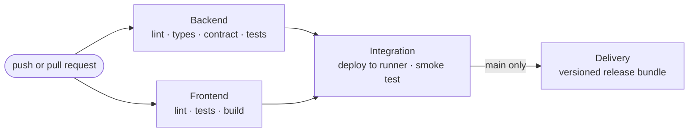

# CI/CD Pipeline

Defined in [`.github/workflows/ci.yml`](../.github/workflows/ci.yml). Runs on
every push and pull request to `main` and `develop`. A newer push to the same
branch cancels the run already in progress, so the result always describes the
latest commit.



## Jobs

### 1. Backend — lint, types, contract, tests

Runs against a real **PostgreSQL 16** service container, the same database the
platform targets in production. SQLite is a local convenience only and never
used in CI.

| Step | Fails the build when |
| --- | --- |
| `ruff check .` | Any lint rule is broken |
| `ruff format --check .` | Any file is not formatted |
| `mypy app` | Any type error in application code |
| `python scripts/export_openapi.py --check` | `docs/openapi.json` no longer matches the routes and schemas |
| `python -m app.bootstrap` | The schema cannot be applied or the synthetic data cannot be seeded |
| `pytest -q` | Any backend test fails, including the API contract and architecture boundary tests |

### 2. Frontend — lint, tests, build

| Step | Fails the build when |
| --- | --- |
| `npm ci` | The lockfile and `package.json` disagree |
| `npm run lint` | ESLint finds a problem, including the Allman brace rule |
| `npm test` | Any Vitest test fails |
| `npm run build` | The production build fails |

The built client is uploaded as the `frontend-dist` artifact.

### 3. Integration — deploy to the runner and smoke test

Starts only after both jobs above pass. It is a deployment rehearsal: install
the backend, apply the schema to a fresh PostgreSQL, seed it, start the real
server with `uvicorn`, and wait for `/api/v1/health` to answer. Then
[`scripts/smoke_test.sh`](../scripts/smoke_test.sh) drives the running system
over HTTP, exactly as a client would:

1. Health check
2. A member signs in and opens a conversation
3. The assistant answers a supported question (`ANSWERED`)
4. Feedback is recorded against that answer
5. A request for a person escalates deterministically (`CUSTOMER_REQUEST`)
6. A second member is refused the first member's conversation (**403**)
7. A counsellor sees the escalated case with its context
8. A member is refused the counsellor's case view (**403**)
9. The counsellor replies, and the member sees the reply in the same conversation
10. The counsellor resolves the case

The Learning Analytics Worker then runs once against the data the smoke test
produced. If any step fails, the server log is printed.

### 4. Delivery — versioned release bundle

Runs only for a push to `main`, and only after integration passes. Pull
requests never reach it. It builds the web client and assembles one deployable
bundle, uploaded as the artifact `skillbridge-<version>-<commit>`:

```
release/
  VERSION              version, full commit hash, UTC build time
  run.py               one-command launcher
  README.md
  backend/             app/, requirements.txt, .env.example
  frontend/dist/       production web client
  docs/                API reference, OpenAPI, architecture, guides
```

The job writes a summary table to the run page with the version, commit, bundle
name and route count.

## What the pipeline never does

- **Call a paid model.** CI sets `AI_PROVIDER=mock`. The mock implements the
  same interface, so the whole conversation path is still exercised.
- **Use a real secret.** The only credential is a throwaway JWT signing value
  that exists solely inside the runner.
- **Touch real personal data.** Every account and service record is synthetic
  and created by `app.bootstrap`.

## Running the same checks locally

```bash
python run.py --check
```

Runs every backend and frontend check above in the same order, plus the
OpenAPI contract check.

---

## Evidence

Screenshots from GitHub Actions on the final `main` commit. To capture: open
the repository on GitHub, select **Actions**, then the most recent **CI** run
on `main`.

### Workflow run history

All recent runs on `main` green.


### One run, all four jobs

The job graph for a single push to `main`: backend and frontend in parallel,
then integration, then delivery.


### Backend job

Expanded to show the contract check and the pytest total.


### Integration smoke test

The smoke-test step ending in `Smoke test passed.`


### Delivery summary and release artifact

The release summary table and the **Artifacts** section showing the
`skillbridge-1.0.0-…` bundle.


### Checks on a pull request

A merged pull request showing all checks passed before merge.


