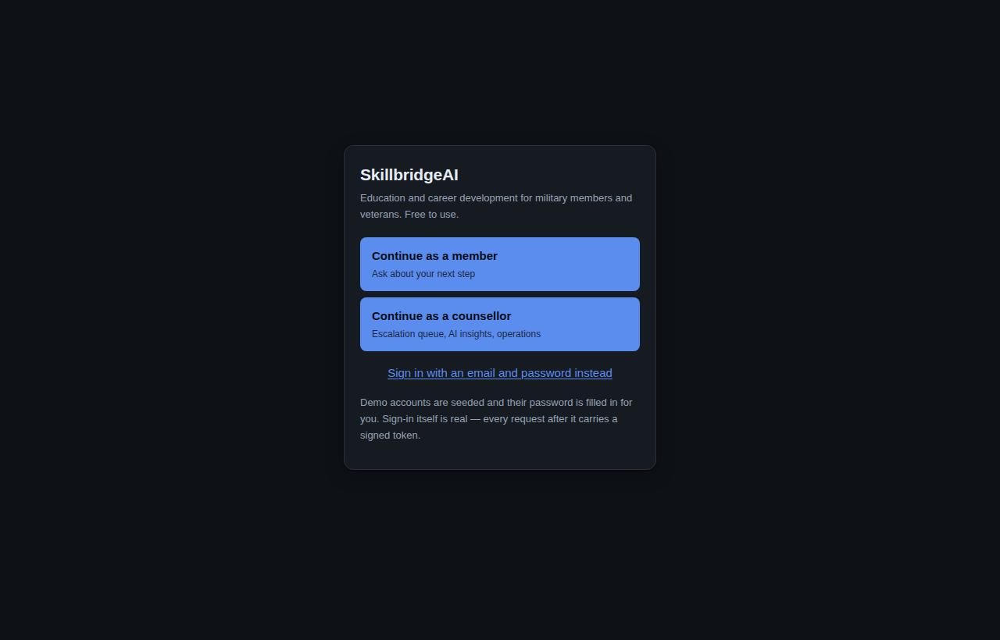
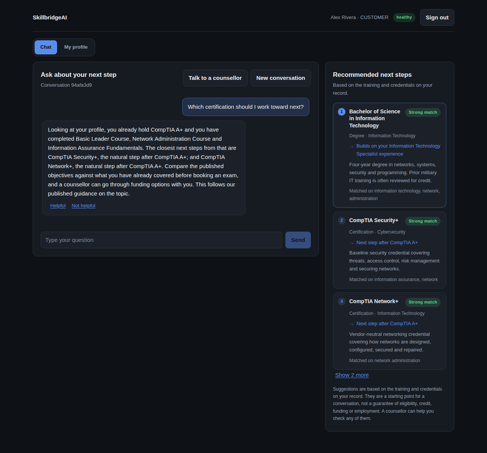
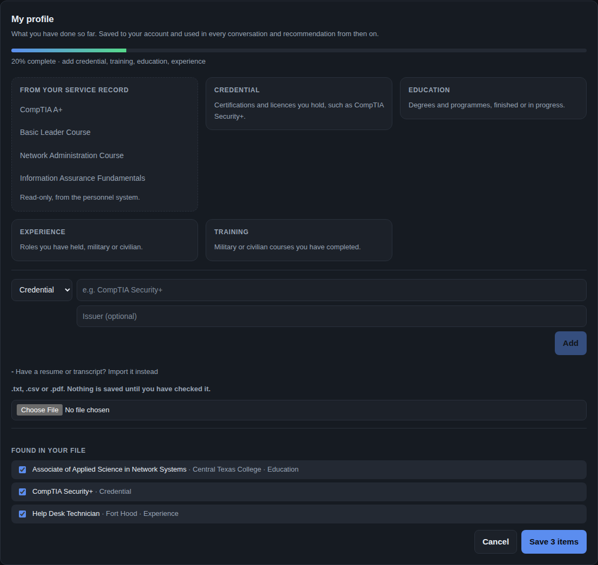
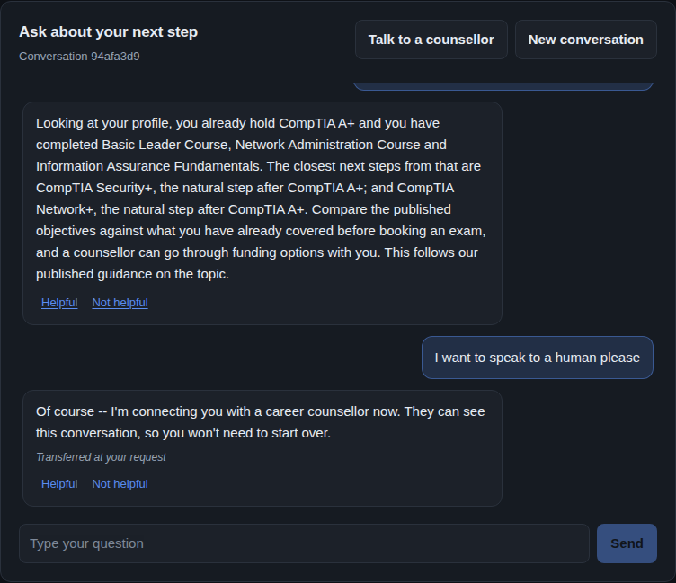
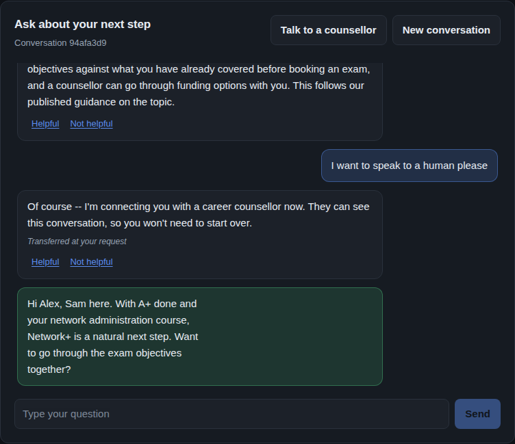
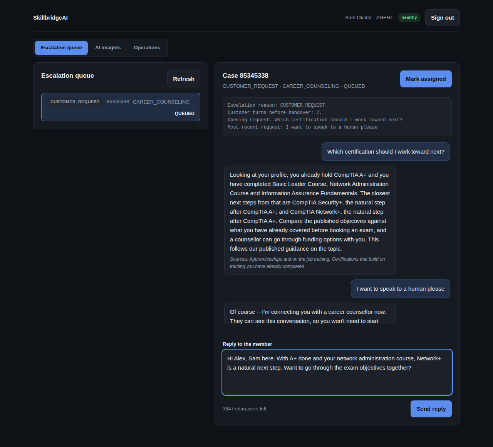
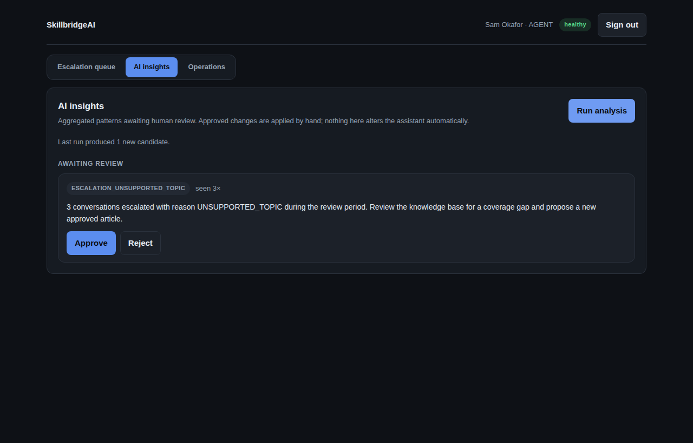
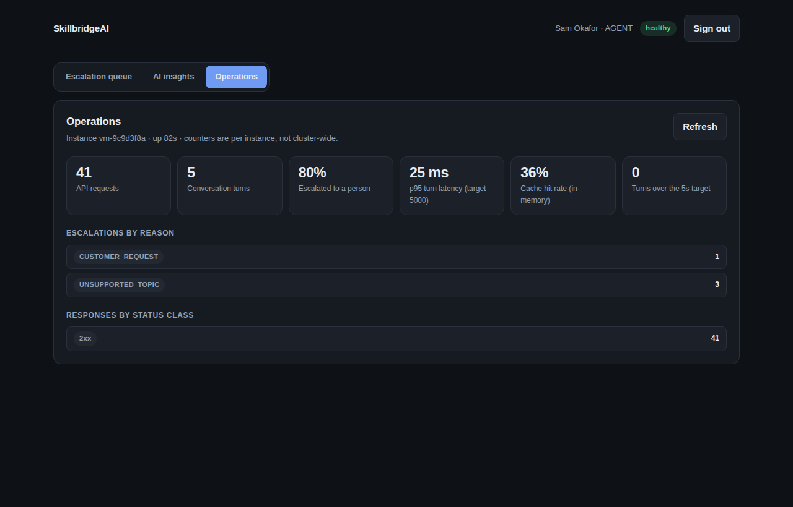

# User Guide

SkillBridge AI is a free service that helps military members and veterans plan
their next step in education and professional development. It has two kinds of
user:

- **Members** ask questions and get suggestions based on the training and
  credentials already on their record.
- **Counsellors** pick up conversations the assistant hands over, reply to
  members, review what the assistant is struggling with, and watch the
  service's health.

Every account and service record in this build is synthetic.

---

## Signing in

In the demonstration build, click **Continue as a member** or **Continue as a
counsellor** — nothing to type. The sign-in is still real: it checks the
password, issues a signed token, and every later request is authorised with
it. To type the details instead, choose **Sign in with an email and password
instead**.

| Account | Email | Password |
| --- | --- | --- |
| Member — Army IT specialist, A+ held | `member@example.com` | `DemoPassw0rd!` |
| Member — Navy hospital corpsman, EMT held | `member2@example.com` | `DemoPassw0rd!` |
| Counsellor | `counselor@example.com` | `DemoPassw0rd!` |

**Sign out** is in the top right. Your session ends when you close the tab.

The interface is dark throughout. That is the only theme; there is no switch
to find and nothing to configure.

---

## For members

A member sees two tabs: **Chat** and **My profile**. Both stay loaded, so
switching between them never loses a half-typed question.

### Asking a question

Type a question in the box at the bottom and press **Send**, or click one of
the example prompts to see how each kind of question is handled.

The assistant answers from approved reference material and from the training
you have already completed. Where an answer draws on a reference article, the
article is listed under the answer. Use **Helpful** / **Not helpful** under any
answer to tell the team how it did; your rating feeds the review described in
the counsellor section.

Good questions to ask:

- *Which certification should I work toward next?*
- *Should I do a degree or a certification first?*
- *How do I describe my training on a civilian resume?*
- *When should I start a SkillBridge internship?*
- *Do my completed courses count toward an apprenticeship?*

The assistant will not enrol you in anything, apply on your behalf, or promise
a job, a place or funding. It will point you to a counsellor for those.

### Choosing the AI model

You never need an API key, an account or any setup — the **built-in advisor**
answers out of the box, using your profile, and costs nothing.

If whoever runs your copy has added Claude or ChatGPT, a **Model** menu
appears at the top of the chat and you can pick between them. Your choice
applies to each message, and every answer says which model wrote it. You are
never asked for a key: there is nowhere to enter one.

The built-in advisor is deliberately narrow. It handles the questions this
service is for — what to study or certify next, degree or credential, how to
describe your background on a resume, what is on your profile. Anything else
it hands to a counsellor rather than guessing.

### My profile

**My profile** is its own tab, next to **Chat** at the top of the page. It is
everything the assistant knows about you, so you never have to repeat it in a
new conversation.

- **From your service record** is what the personnel system holds — military
  training only. You can't edit it here.
- Everything else you enter yourself, in four kinds:

  | Kind | What goes in it |
  | --- | --- |
  | **Credential** | A certification or license — CompTIA Security+, an EMT license |
  | **Education** | A degree, diploma or coursework |
  | **Experience** | A job or role, military or civilian |
  | **Training** | A course or school the service record missed |

  Choose the kind, type the name, optionally add the issuer, school or
  employer, and click **Add**. **Remove** takes an item off again.
  Each kind has its own card, and an empty one says what belongs in it.
- **Have a resume or transcript? Import it instead** is a shortcut if you have
  a long record. Open it, pick a `.txt`, `.csv` or `.pdf`, and everything it
  recognised comes back sorted into those four kinds. Untick anything wrong
  and click **Save**. Nothing is saved until you do, and the file itself is
  never kept.
- The bar at the top shows how complete your profile looks and names what is
  still missing. It is a prompt, not a score — the assistant works at any
  level of completeness.

Changes take effect straight away: the next answer and the recommended next
steps both use them. You can also just ask the assistant *"what do you have on
file for me?"* to hear it back.

### Recommended next steps

The panel beside the chat ranks civilian certifications, licenses, programs
and degrees against what is already on your record. The top three are shown,
numbered best first, with **Show 2 more** underneath for the rest. Each
suggestion tells you **why** it was made:

| Label | Meaning |
| --- | --- |
| **Next step after …** | You already hold a credential this one follows on from |
| **Builds on …** | It overlaps most with that piece of your training or experience |
| **A common starting point** | Nothing on your record matched yet, so these are broadly useful first steps |

*Strong match*, *Good match* and *Worth a look* show how closely it fits.
**Matched on** lists the words your record and the suggestion share.
Credentials you already hold are never suggested.

The panel works even when the assistant is unavailable. Suggestions are a
starting point for a conversation, not a guarantee of eligibility, credit or
funding.

### Talking to a counsellor

Click **Talk to a counsellor**, or simply ask for a person. The conversation
is handed to a counsellor, who can see everything said so far — you will not
need to start over. The assistant also hands over on its own when:

| You see | Why |
| --- | --- |
| *Transferred at your request* | You asked for a person |
| *Routed to account security* | The message mentioned a possible account or security problem |
| *Outside what the assistant can answer* | The question is outside education and career topics |
| *Answer failed our quality checks* | The assistant's draft answer broke a rule, so it was not shown |
| *Assistant service unavailable* | The AI service could not be reached |

When the counsellor replies, the reply appears in the same chat, in green,
within a few seconds. You do not need to refresh.

**New conversation** starts a fresh thread.

---

## For counsellors

The dashboard has three tabs.

### Escalation queue

The left panel lists open cases with the reason for each handover. Click one
to open it on the right: a summary of why it was handed over, then the full
conversation.

- **Reply to the member** — type in your own words and click **Send reply**.
  The member sees it in their chat. Replying also assigns the case to you.
- **Mark assigned / resolved / closed** — moves the case on. Resolving or
  closing it ends the conversation for the member; a resolved case can no
  longer be replied to.
- **Refresh** — reload the queue.

If another counsellor already holds a case, you can read it, but a reply is
refused so the member is never answered by two people at once.

### AI insights

The Learning Analytics Worker looks for patterns across many conversations —
for example several members asking about a topic the assistant cannot answer.
Click **Run analysis** to look now. Each pattern becomes a candidate you can
**Approve** or **Reject**.

Nothing here changes the assistant by itself. An approval records the
decision; a person still makes the change. A single conversation can never
alter how the assistant behaves.

### Operations

Live counters for the server you are connected to: requests, conversation
turns, the share handed to a person, p95 response time against the
five-second target, cache hit rate, and escalations by reason. Counters are
per server and reset when it restarts.

---

## Getting help

- Setup problems: [`INSTALL.md`](INSTALL.md), section 7.
- API details for developers: [`API.md`](API.md), or <http://127.0.0.1:8000/docs>
  while the platform is running.
